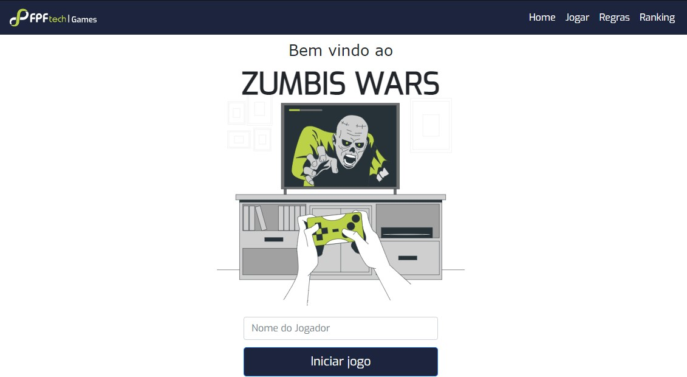

<div id="top"></div>

## Sobre o Projeto
Consiste no desenvolvimento de um jogo em turnos, onde o jogador e um inimigo batalham até que os pontos de vida de um deles chegue a zero, o usuário pode interagir através de botões que executarão ações variadas e em seguida a ação do monstro será tomada automaticamente pela aplicação. 

<div align="center">
  <a href="https://gitlab.com/britotarlison/turngame/-/blob/main/imgReadme.jpg">
    
  </a>
</div>


### Built With

Aqui temos uma lista das tecnologias utilizados no projeto.


* [React.js](https://reactjs.org/)
* [TypeScript.js](https://www.typescriptlang.org)
* [Node.js](https://nodejs.org/en/)
* [Bootstrap](https://getbootstrap.com)
* [MongoDB](https://www.mongodb.com)
* [Docker](https://www.docker.com)


## Usando a aplicação

### Instalação e utilização COM o Docker

_Segue abaixo como baixar, instalar as dependências e rodar a aplicação. Execute os comandos um por vez._

1. Clone o repositório
   ```sh
   git clone https://gitlab.com/britotarlison/turngame.git
   ```
2. Construa os containers.
   ```sh
   docker-compose build
   ```
3. Suba os containers.
   ```sh
   docker-compose up
   ```
4. Agora basta acessar no seu navegador `http://localhost:3000`


### Instalação e utilização SEM o Docker

_Segue abaixo como baixar, instalar as dependências e rodar a aplicação. Execute os comandos um por vez._

1. Clone o repositório
   ```sh
   git clone https://gitlab.com/britotarlison/turngame.git
   ```
2. Entra na pasta ./backend e Instale os pacotes NPM e inicie.
   ```sh
   cd backend
   npm install
   npm run debug
   ```
3. Entra na pasta ./frontend e Instale os pacotes YARN e inicie.
   ```sh
   cd frontend
   yarn install 
   yarn start
   ```
4. Agora basta acessar no seu navegador `http://localhost:3000`


<p align="right">(<a href="#top">back to top</a>)</p>


[linkedin-shield]: https://img.shields.io/badge/-LinkedIn-black.svg?style=for-the-badge&logo=linkedin&colorB=555
[linkedin-url]: https://www.linkedin.com/in/tarlison-brito-187183177/

© 2021